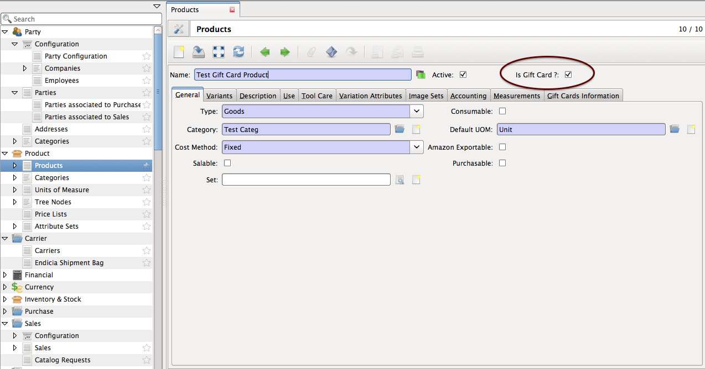
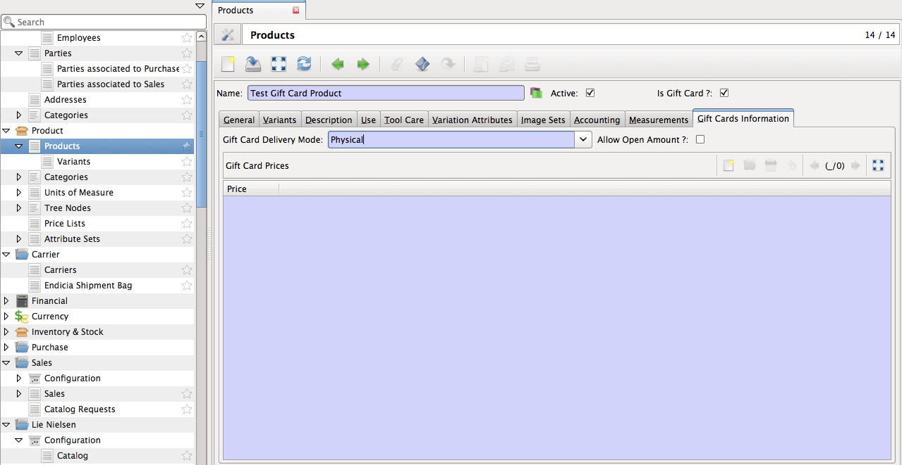
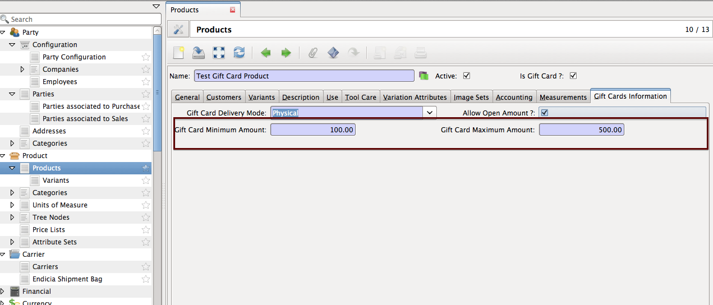
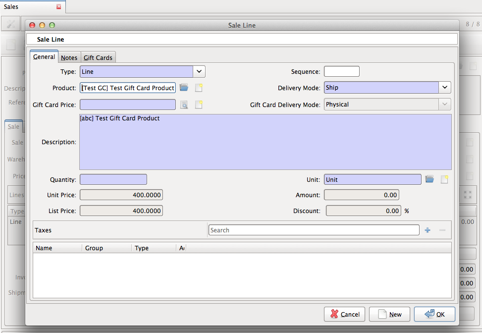
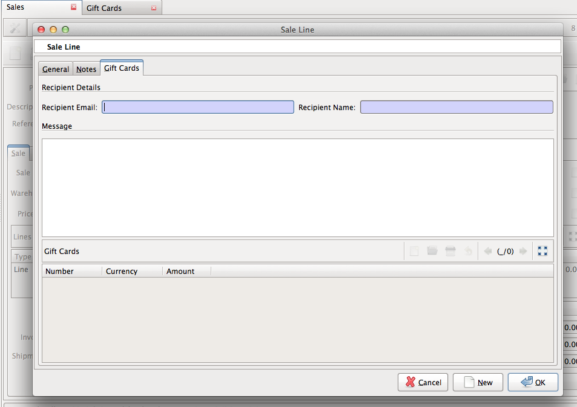
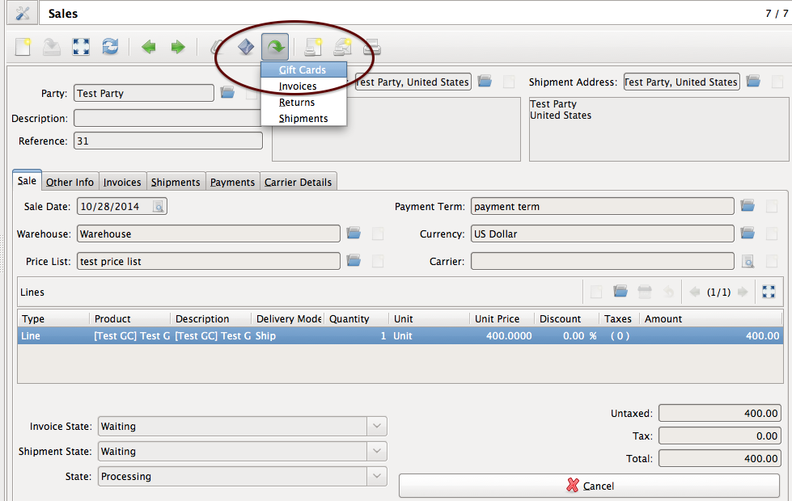
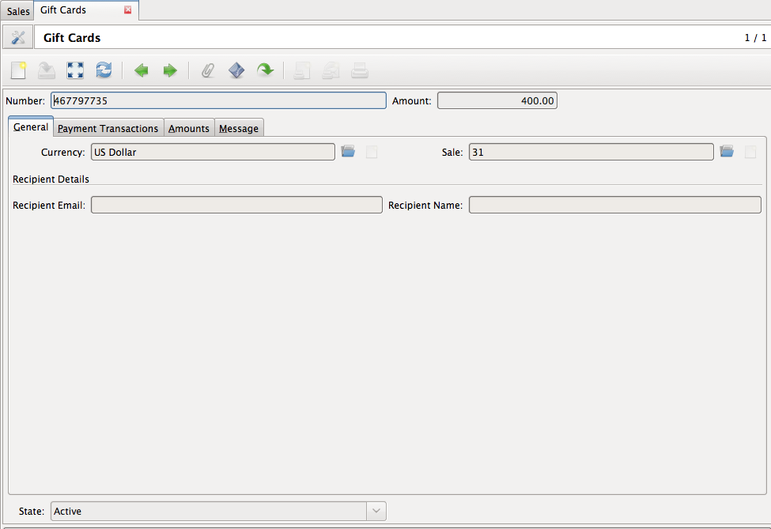

.. _Gift Card:

==========
Gift Card
==========

Gift Cards can be categorised into:

 **Virtual**
 
 This gift card is sent out to recipient through email.
 
 This requires recipient email address. Though shipping address is not required.

 **Physical**
 
 This gift card gets shipped to recipient shipping address once purchased.

 **Combined**
 
 This gift card can be used as both virtual and physical gift card.
 
 So it requires recipient email address and shipping address both.

Create Gift Card Product
-------------------------

 Go to ``Product >> Products`` and create product.

**Is Gift Card?**

For gift card product, boolean ``Is Gift Card ?`` needs to be checked,
which tells if product is gift card product or not. It
makes another tab ``Gift Cards Information`` visible.

**Gift Card Delivery Mode**

Defines mode of gift card product to be delievered. See `Gift Card`_ for
more info.

**Allow Open Amount**

Boolean field to setup gift card product prices.

* If unchecked, Product must have predefined prices that user can choose while buying the gift card. To add predefined prices add prices to ``Gift Card Prices`` as shown below.

.. figure:: images/predefined_prices.png

* If checked, minimum and maximum amounts need to be defined for gift card product as shown below. With this gift card price can be set within this range only.

Fill all the required details and save.

Buy Gift Card
-------------

To buy gift card, sale needs to be created.

- Go to ``Sales >> Sales`` and create sale with sale line having gift card product as product.

- Fill ``Quantity`` with the number of gift cards you want to buy.

- Fill ``Unit Price`` with the price you want to use on gift card. By default it takes product price.

- Select price using ``Gift Card Price`` if gift card product does not allows open amount. Or set a price between range defined for product.

- Fill out recipient details if gift card delivery mode is virtual or combined.

- Fill out other required details and save.

Once sale is processed, Gift cards will be created for this sale.
Gift card will be sent by email to recipient email address in case of virtual or
combined delivery mode.

For more info on delivery modes, please see `Gift Card`_ .

View Gift Cards
---------------

To view ``Gift Cards`` for particular sale, open sale and click Relate icon as
shown below and select ``Gift Cards``.

It will open up all gift cards for this sale.

